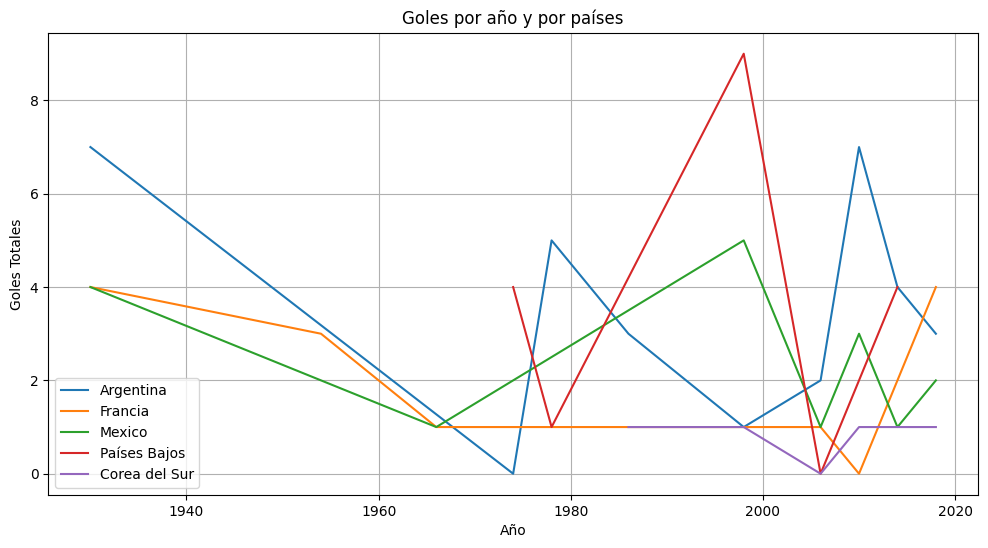
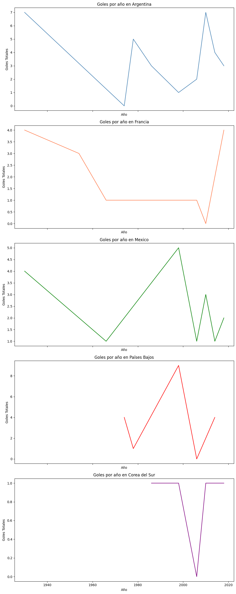

# Tarea Semana 4

### Jessy Suarez A. /  LIDE  / Modulo Python 

## Instrucciones

Utilizando los datos sobre los partidos de la copa de fútbol masculina en español aquí: https://github.com/cienciadedatos/datos-de-miercoles/tree/master/datos/2019/2019-04-10 van a crear dos gráficos que comparen dos o más países.

Acceder los datos de manera remota, es decir no bajándolos a su computadora.

Crear dos gráficos en el que comparen a al menos dos países diferentes. Si quieren incluir a más países pueden hacerlo.

Gráfico 1 deberá ser un gráfico en el que los datos de los países comparados aparezcan en el mismo cuadro

Gráfico 2 deberá ser un gráfico en el que los datos de cada país aparezca en un subgráfico diferente. Es decir, una figura tenga al menos dos recuadros (uno por cada país en la comparación).

Los gráficos deberán tener un título general

Los gráficos deberán tener etiquetas en cada eje

Deberán mostrar cómo guardar un gráfico

Deberán incluir solamente documentos relevantes en su repositorio

## Codigo

### Importar paquetes


```python
import numpy as np
import pandas as pd
```

### Importar datos 


```python
partidos_cm=pd.read_csv('https://raw.githubusercontent.com/cienciadedatos/datos-de-miercoles/master/datos/2019/2019-04-10/partidos.txt', delimiter='\t')
partidos_cm
```


<div>
<style scoped>
    .dataframe tbody tr th:only-of-type {
        vertical-align: middle;
    }

    .dataframe tbody tr th {
        vertical-align: top;
    }

    .dataframe thead th {
        text-align: right;
    }
</style>
<table border="1" class="dataframe">
  <thead>
    <tr style="text-align: right;">
      <th></th>
      <th>anio</th>
      <th>anfitrion</th>
      <th>estadio</th>
      <th>ciudad</th>
      <th>partido_orden</th>
      <th>fecha</th>
      <th>equipo_1</th>
      <th>equipo_2</th>
      <th>equipo_1_final</th>
      <th>equipo_2_final</th>
    </tr>
  </thead>
  <tbody>
    <tr>
      <th>0</th>
      <td>1930</td>
      <td>Uruguay</td>
      <td>Estadio Pocitos</td>
      <td>Montevideo</td>
      <td>(1)</td>
      <td>1930-07-13</td>
      <td>Francia</td>
      <td>Mexico</td>
      <td>4</td>
      <td>1</td>
    </tr>
    <tr>
      <th>1</th>
      <td>1930</td>
      <td>Uruguay</td>
      <td>Estadio Parque Central</td>
      <td>Montevideo</td>
      <td>(2)</td>
      <td>1930-07-13</td>
      <td>Estados Unidos</td>
      <td>Bélgica</td>
      <td>3</td>
      <td>0</td>
    </tr>
    <tr>
      <th>2</th>
      <td>1930</td>
      <td>Uruguay</td>
      <td>Estadio Parque Central</td>
      <td>Montevideo</td>
      <td>(3)</td>
      <td>1930-07-14</td>
      <td>Yugoslavia</td>
      <td>Brasil</td>
      <td>2</td>
      <td>1</td>
    </tr>
    <tr>
      <th>3</th>
      <td>1930</td>
      <td>Uruguay</td>
      <td>Estadio Pocitos</td>
      <td>Montevideo</td>
      <td>(4)</td>
      <td>1930-07-14</td>
      <td>Rumania</td>
      <td>Perú</td>
      <td>3</td>
      <td>1</td>
    </tr>
    <tr>
      <th>4</th>
      <td>1930</td>
      <td>Uruguay</td>
      <td>Estadio Parque Central</td>
      <td>Montevideo</td>
      <td>(5)</td>
      <td>1930-07-15</td>
      <td>Argentina</td>
      <td>Francia</td>
      <td>1</td>
      <td>0</td>
    </tr>
    <tr>
      <th>...</th>
      <td>...</td>
      <td>...</td>
      <td>...</td>
      <td>...</td>
      <td>...</td>
      <td>...</td>
      <td>...</td>
      <td>...</td>
      <td>...</td>
      <td>...</td>
    </tr>
    <tr>
      <th>895</th>
      <td>2018</td>
      <td>Rusia</td>
      <td>Samara Arena</td>
      <td>Samara (UTC+4)</td>
      <td>(60)</td>
      <td>2018-07-07</td>
      <td>Suecia</td>
      <td>Inglaterra</td>
      <td>0</td>
      <td>2</td>
    </tr>
    <tr>
      <th>896</th>
      <td>2018</td>
      <td>Rusia</td>
      <td>Saint Petersburg Stadium</td>
      <td>St. Petersburg (UTC+3)</td>
      <td>(61)</td>
      <td>2018-07-10</td>
      <td>Francia</td>
      <td>Bélgica</td>
      <td>1</td>
      <td>0</td>
    </tr>
    <tr>
      <th>897</th>
      <td>2018</td>
      <td>Rusia</td>
      <td>Luzhniki Stadium</td>
      <td>Moscow (UTC+3)</td>
      <td>(62)</td>
      <td>2018-07-11</td>
      <td>Croacia</td>
      <td>Inglaterra</td>
      <td>2</td>
      <td>1</td>
    </tr>
    <tr>
      <th>898</th>
      <td>2018</td>
      <td>Rusia</td>
      <td>Saint Petersburg Stadium</td>
      <td>St. Petersburg (UTC+3)</td>
      <td>(63)</td>
      <td>2018-07-14</td>
      <td>Bélgica</td>
      <td>Inglaterra</td>
      <td>2</td>
      <td>0</td>
    </tr>
    <tr>
      <th>899</th>
      <td>2018</td>
      <td>Rusia</td>
      <td>Luzhniki Stadium</td>
      <td>Moscow (UTC+3)</td>
      <td>(64)</td>
      <td>2018-07-15</td>
      <td>Francia</td>
      <td>Croacia</td>
      <td>4</td>
      <td>2</td>
    </tr>
  </tbody>
</table>
<p>900 rows × 10 columns</p>
</div>


### Lineas de codigo


```python
partidos_cm.columns.values
```


    array(['anio', 'anfitrion', 'estadio', 'ciudad', 'partido_orden', 'fecha',
           'equipo_1', 'equipo_2', 'equipo_1_final', 'equipo_2_final'],
          dtype=object)


```python
# Paises que deseo analizar
paises = ['Francia', 'Argentina', 'México', 'Países Bajos', 'Corea del Sur']
```


```python
partidos_equipos =partidos_cm[(partidos_cm['equipo_1'].isin(['Francia', 'Argentina', 'Mexico','Países Bajos','Corea del Sur'])) & (partidos_cm['equipo_2'].isin(['Francia', 'Argentina', 'Mexico','Paises Bajos','Corea del Sur']))]

partidos_equipos
```


<div>
<style scoped>
    .dataframe tbody tr th:only-of-type {
        vertical-align: middle;
    }

    .dataframe tbody tr th {
        vertical-align: top;
    }

    .dataframe thead th {
        text-align: right;
    }
</style>
<table border="1" class="dataframe">
  <thead>
    <tr style="text-align: right;">
      <th></th>
      <th>anio</th>
      <th>anfitrion</th>
      <th>estadio</th>
      <th>ciudad</th>
      <th>partido_orden</th>
      <th>fecha</th>
      <th>equipo_1</th>
      <th>equipo_2</th>
      <th>equipo_1_final</th>
      <th>equipo_2_final</th>
    </tr>
  </thead>
  <tbody>
    <tr>
      <th>0</th>
      <td>1930</td>
      <td>Uruguay</td>
      <td>Estadio Pocitos</td>
      <td>Montevideo</td>
      <td>(1)</td>
      <td>1930-07-13</td>
      <td>Francia</td>
      <td>Mexico</td>
      <td>4</td>
      <td>1</td>
    </tr>
    <tr>
      <th>4</th>
      <td>1930</td>
      <td>Uruguay</td>
      <td>Estadio Parque Central</td>
      <td>Montevideo</td>
      <td>(5)</td>
      <td>1930-07-15</td>
      <td>Argentina</td>
      <td>Francia</td>
      <td>1</td>
      <td>0</td>
    </tr>
    <tr>
      <th>10</th>
      <td>1930</td>
      <td>Uruguay</td>
      <td>Estadio Centenario</td>
      <td>Montevideo</td>
      <td>(11)</td>
      <td>1930-07-19</td>
      <td>Argentina</td>
      <td>Mexico</td>
      <td>6</td>
      <td>3</td>
    </tr>
    <tr>
      <th>84</th>
      <td>1954</td>
      <td>Suiza</td>
      <td>Charmilles Stadium</td>
      <td>Geneva</td>
      <td>(11)</td>
      <td>1954-06-19</td>
      <td>Francia</td>
      <td>Mexico</td>
      <td>3</td>
      <td>2</td>
    </tr>
    <tr>
      <th>172</th>
      <td>1966</td>
      <td>Inglaterra</td>
      <td>Wembley Stadium</td>
      <td>London</td>
      <td>(5)</td>
      <td>1966-07-13</td>
      <td>Francia</td>
      <td>Mexico</td>
      <td>1</td>
      <td>1</td>
    </tr>
    <tr>
      <th>257</th>
      <td>1974</td>
      <td>Alemania occidental</td>
      <td>Parkstadion</td>
      <td>Gelsenkirchen</td>
      <td>(26)</td>
      <td>1974-06-26</td>
      <td>Países Bajos</td>
      <td>Argentina</td>
      <td>4</td>
      <td>0</td>
    </tr>
    <tr>
      <th>278</th>
      <td>1978</td>
      <td>Argentina</td>
      <td>Estadio Monumental</td>
      <td>Buenos Aires</td>
      <td>(9)</td>
      <td>1978-06-06</td>
      <td>Argentina</td>
      <td>Francia</td>
      <td>2</td>
      <td>1</td>
    </tr>
    <tr>
      <th>307</th>
      <td>1978</td>
      <td>Argentina</td>
      <td>Estadio Monumental</td>
      <td>Buenos Aires</td>
      <td>(38)</td>
      <td>1978-06-25</td>
      <td>Países Bajos</td>
      <td>Argentina</td>
      <td>1</td>
      <td>3</td>
    </tr>
    <tr>
      <th>363</th>
      <td>1986</td>
      <td>Mexico</td>
      <td>Estadio Olímpico Universitario</td>
      <td>Mexico City</td>
      <td>(4)</td>
      <td>1986-06-02</td>
      <td>Argentina</td>
      <td>Corea del Sur</td>
      <td>3</td>
      <td>1</td>
    </tr>
    <tr>
      <th>525</th>
      <td>1998</td>
      <td>Francia</td>
      <td>Stade Gerland</td>
      <td>Lyon</td>
      <td>(9)</td>
      <td>1998-06-13</td>
      <td>Corea del Sur</td>
      <td>Mexico</td>
      <td>1</td>
      <td>3</td>
    </tr>
    <tr>
      <th>540</th>
      <td>1998</td>
      <td>Francia</td>
      <td>Stade Vélodrome</td>
      <td>Marseille</td>
      <td>(25)</td>
      <td>1998-06-20</td>
      <td>Países Bajos</td>
      <td>Corea del Sur</td>
      <td>5</td>
      <td>0</td>
    </tr>
    <tr>
      <th>557</th>
      <td>1998</td>
      <td>Francia</td>
      <td>Stade Geoffroy-Guichard</td>
      <td>Saint-Étienne</td>
      <td>(42)</td>
      <td>1998-06-25</td>
      <td>Países Bajos</td>
      <td>Mexico</td>
      <td>2</td>
      <td>2</td>
    </tr>
    <tr>
      <th>575</th>
      <td>1998</td>
      <td>Francia</td>
      <td>Stade Vélodrome</td>
      <td>Marseille</td>
      <td>(60)</td>
      <td>1998-07-04</td>
      <td>Países Bajos</td>
      <td>Argentina</td>
      <td>2</td>
      <td>1</td>
    </tr>
    <tr>
      <th>672</th>
      <td>2006</td>
      <td>Alemania</td>
      <td>Zentralstadion</td>
      <td>Leipzig</td>
      <td>(29)</td>
      <td>2006-06-18</td>
      <td>Francia</td>
      <td>Corea del Sur</td>
      <td>1</td>
      <td>0</td>
    </tr>
    <tr>
      <th>680</th>
      <td>2006</td>
      <td>Alemania</td>
      <td>Commerzbank-Arena</td>
      <td>Frankfurt</td>
      <td>(37)</td>
      <td>2006-06-21</td>
      <td>Países Bajos</td>
      <td>Argentina</td>
      <td>0</td>
      <td>0</td>
    </tr>
    <tr>
      <th>693</th>
      <td>2006</td>
      <td>Alemania</td>
      <td>Zentralstadion</td>
      <td>Leipzig</td>
      <td>(50)</td>
      <td>2006-06-24</td>
      <td>Argentina</td>
      <td>Mexico</td>
      <td>2</td>
      <td>1</td>
    </tr>
    <tr>
      <th>725</th>
      <td>2010</td>
      <td>Sudáfrica</td>
      <td>Peter Mokaba Stadium</td>
      <td>Polokwane</td>
      <td>(18)</td>
      <td>2010-06-17</td>
      <td>Francia</td>
      <td>Mexico</td>
      <td>0</td>
      <td>2</td>
    </tr>
    <tr>
      <th>726</th>
      <td>2010</td>
      <td>Sudáfrica</td>
      <td>Soccer City</td>
      <td>Johannesburg</td>
      <td>(20)</td>
      <td>2010-06-17</td>
      <td>Argentina</td>
      <td>Corea del Sur</td>
      <td>4</td>
      <td>1</td>
    </tr>
    <tr>
      <th>759</th>
      <td>2010</td>
      <td>Sudáfrica</td>
      <td>Soccer City</td>
      <td>Johannesburg</td>
      <td>(52)</td>
      <td>2010-06-27</td>
      <td>Argentina</td>
      <td>Mexico</td>
      <td>3</td>
      <td>1</td>
    </tr>
    <tr>
      <th>822</th>
      <td>2014</td>
      <td>Brasil</td>
      <td>Estádio Castelão</td>
      <td>Fortaleza (UTC-3)        # 1B - 2A</td>
      <td>(51)</td>
      <td>2014-06-29</td>
      <td>Países Bajos</td>
      <td>Mexico</td>
      <td>2</td>
      <td>1</td>
    </tr>
    <tr>
      <th>833</th>
      <td>2014</td>
      <td>Brasil</td>
      <td>Arena de São Paulo</td>
      <td>São Paulo (UTC-3)    # W59 - W69</td>
      <td>(62)</td>
      <td>2014-07-09</td>
      <td>Países Bajos</td>
      <td>Argentina</td>
      <td>2</td>
      <td>4</td>
    </tr>
    <tr>
      <th>862</th>
      <td>2018</td>
      <td>Rusia</td>
      <td>Rostov Arena</td>
      <td>Rostov-on-Don (UTC+3)</td>
      <td>(28)</td>
      <td>2018-06-23</td>
      <td>Corea del Sur</td>
      <td>Mexico</td>
      <td>1</td>
      <td>2</td>
    </tr>
    <tr>
      <th>885</th>
      <td>2018</td>
      <td>Rusia</td>
      <td>Kazan Arena</td>
      <td>Kazan (UTC+3)</td>
      <td>(50)</td>
      <td>2018-06-30</td>
      <td>Francia</td>
      <td>Argentina</td>
      <td>4</td>
      <td>3</td>
    </tr>
  </tbody>
</table>
</div>


```python
# suma de goles totales por paises seleccionados en equipo_1_final
sum_pais_1 = partidos_equipos.groupby('equipo_1')['equipo_1_final'].sum()
sum_pais_1
```


    equipo_1
    Argentina        21
    Corea del Sur     2
    Francia          13
    Países Bajos     18
    Name: equipo_1_final, dtype: int64


```python
# suma de goles totales por paises seleccionados en equipo_2_final
sum_pais_2 = partidos_equipos.groupby('equipo_2')['equipo_2_final'].sum()
sum_pais_2
```


    equipo_2
    Argentina        11
    Corea del Sur     2
    Francia           1
    Mexico           19
    Name: equipo_2_final, dtype: int64


```python
# suma de puntajes del mayor goleador 
sum_puntajes = pd.concat([sum_pais_1, sum_pais_2])
puntajes_totales = sum_pais_1.add(sum_pais_2, fill_value=0)
puntajes_totales
```


    Argentina        32.0
    Corea del Sur     4.0
    Francia          14.0
    Mexico           19.0
    Países Bajos     18.0
    dtype: float64


```python
# DataFrame con la columna "total"
nuevo_dataframe = pd.DataFrame({'País': puntajes_totales.index, 'Total': puntajes_totales.values})
nuevo_dataframe=nuevo_dataframe.sort_values(by='Total',ascending=False)
nuevo_dataframe
```


<div>
<style scoped>
    .dataframe tbody tr th:only-of-type {
        vertical-align: middle;
    }

    .dataframe tbody tr th {
        vertical-align: top;
    }

    .dataframe thead th {
        text-align: right;
    }
</style>
<table border="1" class="dataframe">
  <thead>
    <tr style="text-align: right;">
      <th></th>
      <th>País</th>
      <th>Total</th>
    </tr>
  </thead>
  <tbody>
    <tr>
      <th>0</th>
      <td>Argentina</td>
      <td>32.0</td>
    </tr>
    <tr>
      <th>3</th>
      <td>Mexico</td>
      <td>19.0</td>
    </tr>
    <tr>
      <th>4</th>
      <td>Países Bajos</td>
      <td>18.0</td>
    </tr>
    <tr>
      <th>2</th>
      <td>Francia</td>
      <td>14.0</td>
    </tr>
    <tr>
      <th>1</th>
      <td>Corea del Sur</td>
      <td>4.0</td>
    </tr>
  </tbody>
</table>
</div>


Podemos observar que de los paises elegidos para el analisis el Pais con mayor numero de anotaciones es Argentina con 32 goles a los largo del tiempo.


```python
#analisis de goles por anio para comparacion por paises
goles_por_anio_equipo_1 = partidos_equipos.groupby(['anio', 'equipo_1'])['equipo_1_final'].sum().reset_index()
goles_por_anio_equipo_2 = partidos_equipos.groupby(['anio', 'equipo_2'])['equipo_2_final'].sum().reset_index()
```


```python
# Renombrar las columnas
goles_por_anio_equipo_1 = goles_por_anio_equipo_1.rename(columns={'equipo_1': 'Equipo','equipo_1_final':'Goles'})
goles_por_anio_equipo_2 = goles_por_anio_equipo_2.rename(columns={'equipo_2': 'Equipo','equipo_2_final':'Goles'})

# Combinar los DataFrames
goles_por_anio = pd.concat([goles_por_anio_equipo_1, goles_por_anio_equipo_2], ignore_index=True)

# Ordenar los datos por año y equipo
goles_por_anio = goles_por_anio.sort_values(by=['anio', 'Equipo'])

print("Goles por año y equipo:")
goles_por_anio
```

    Goles por año y equipo:


<div>
<style scoped>
    .dataframe tbody tr th:only-of-type {
        vertical-align: middle;
    }

    .dataframe tbody tr th {
        vertical-align: top;
    }

    .dataframe thead th {
        text-align: right;
    }
</style>
<table border="1" class="dataframe">
  <thead>
    <tr style="text-align: right;">
      <th></th>
      <th>anio</th>
      <th>Equipo</th>
      <th>Goles</th>
    </tr>
  </thead>
  <tbody>
    <tr>
      <th>0</th>
      <td>1930</td>
      <td>Argentina</td>
      <td>7</td>
    </tr>
    <tr>
      <th>1</th>
      <td>1930</td>
      <td>Francia</td>
      <td>4</td>
    </tr>
    <tr>
      <th>18</th>
      <td>1930</td>
      <td>Francia</td>
      <td>0</td>
    </tr>
    <tr>
      <th>19</th>
      <td>1930</td>
      <td>Mexico</td>
      <td>4</td>
    </tr>
    <tr>
      <th>2</th>
      <td>1954</td>
      <td>Francia</td>
      <td>3</td>
    </tr>
    <tr>
      <th>20</th>
      <td>1954</td>
      <td>Mexico</td>
      <td>2</td>
    </tr>
    <tr>
      <th>3</th>
      <td>1966</td>
      <td>Francia</td>
      <td>1</td>
    </tr>
    <tr>
      <th>21</th>
      <td>1966</td>
      <td>Mexico</td>
      <td>1</td>
    </tr>
    <tr>
      <th>22</th>
      <td>1974</td>
      <td>Argentina</td>
      <td>0</td>
    </tr>
    <tr>
      <th>4</th>
      <td>1974</td>
      <td>Países Bajos</td>
      <td>4</td>
    </tr>
    <tr>
      <th>5</th>
      <td>1978</td>
      <td>Argentina</td>
      <td>2</td>
    </tr>
    <tr>
      <th>23</th>
      <td>1978</td>
      <td>Argentina</td>
      <td>3</td>
    </tr>
    <tr>
      <th>24</th>
      <td>1978</td>
      <td>Francia</td>
      <td>1</td>
    </tr>
    <tr>
      <th>6</th>
      <td>1978</td>
      <td>Países Bajos</td>
      <td>1</td>
    </tr>
    <tr>
      <th>7</th>
      <td>1986</td>
      <td>Argentina</td>
      <td>3</td>
    </tr>
    <tr>
      <th>25</th>
      <td>1986</td>
      <td>Corea del Sur</td>
      <td>1</td>
    </tr>
    <tr>
      <th>26</th>
      <td>1998</td>
      <td>Argentina</td>
      <td>1</td>
    </tr>
    <tr>
      <th>8</th>
      <td>1998</td>
      <td>Corea del Sur</td>
      <td>1</td>
    </tr>
    <tr>
      <th>27</th>
      <td>1998</td>
      <td>Corea del Sur</td>
      <td>0</td>
    </tr>
    <tr>
      <th>28</th>
      <td>1998</td>
      <td>Mexico</td>
      <td>5</td>
    </tr>
    <tr>
      <th>9</th>
      <td>1998</td>
      <td>Países Bajos</td>
      <td>9</td>
    </tr>
    <tr>
      <th>10</th>
      <td>2006</td>
      <td>Argentina</td>
      <td>2</td>
    </tr>
    <tr>
      <th>29</th>
      <td>2006</td>
      <td>Argentina</td>
      <td>0</td>
    </tr>
    <tr>
      <th>30</th>
      <td>2006</td>
      <td>Corea del Sur</td>
      <td>0</td>
    </tr>
    <tr>
      <th>11</th>
      <td>2006</td>
      <td>Francia</td>
      <td>1</td>
    </tr>
    <tr>
      <th>31</th>
      <td>2006</td>
      <td>Mexico</td>
      <td>1</td>
    </tr>
    <tr>
      <th>12</th>
      <td>2006</td>
      <td>Países Bajos</td>
      <td>0</td>
    </tr>
    <tr>
      <th>13</th>
      <td>2010</td>
      <td>Argentina</td>
      <td>7</td>
    </tr>
    <tr>
      <th>32</th>
      <td>2010</td>
      <td>Corea del Sur</td>
      <td>1</td>
    </tr>
    <tr>
      <th>14</th>
      <td>2010</td>
      <td>Francia</td>
      <td>0</td>
    </tr>
    <tr>
      <th>33</th>
      <td>2010</td>
      <td>Mexico</td>
      <td>3</td>
    </tr>
    <tr>
      <th>34</th>
      <td>2014</td>
      <td>Argentina</td>
      <td>4</td>
    </tr>
    <tr>
      <th>35</th>
      <td>2014</td>
      <td>Mexico</td>
      <td>1</td>
    </tr>
    <tr>
      <th>15</th>
      <td>2014</td>
      <td>Países Bajos</td>
      <td>4</td>
    </tr>
    <tr>
      <th>36</th>
      <td>2018</td>
      <td>Argentina</td>
      <td>3</td>
    </tr>
    <tr>
      <th>16</th>
      <td>2018</td>
      <td>Corea del Sur</td>
      <td>1</td>
    </tr>
    <tr>
      <th>17</th>
      <td>2018</td>
      <td>Francia</td>
      <td>4</td>
    </tr>
    <tr>
      <th>37</th>
      <td>2018</td>
      <td>Mexico</td>
      <td>2</td>
    </tr>
  </tbody>
</table>
</div>


### Resumen tabla final de goles por anio por cada equipo seleccionado


```python
# Agrupar y sumar los goles por año y equipo
goles_por_anio_paises = goles_por_anio.groupby(['anio', 'Equipo'])['Goles'].sum().reset_index()

# Renombrar la columna de goles
goles_por_anio_paises = goles_por_anio_paises.rename(columns={'Goles': 'Goles Totales'})

# Mostrar la tabla final
print("Goles por año y por países:")
goles_por_anio_paises
```

    Goles por año y por países:


<div>
<style scoped>
    .dataframe tbody tr th:only-of-type {
        vertical-align: middle;
    }

    .dataframe tbody tr th {
        vertical-align: top;
    }

    .dataframe thead th {
        text-align: right;
    }
</style>
<table border="1" class="dataframe">
  <thead>
    <tr style="text-align: right;">
      <th></th>
      <th>anio</th>
      <th>Equipo</th>
      <th>Goles Totales</th>
    </tr>
  </thead>
  <tbody>
    <tr>
      <th>0</th>
      <td>1930</td>
      <td>Argentina</td>
      <td>7</td>
    </tr>
    <tr>
      <th>1</th>
      <td>1930</td>
      <td>Francia</td>
      <td>4</td>
    </tr>
    <tr>
      <th>2</th>
      <td>1930</td>
      <td>Mexico</td>
      <td>4</td>
    </tr>
    <tr>
      <th>3</th>
      <td>1954</td>
      <td>Francia</td>
      <td>3</td>
    </tr>
    <tr>
      <th>4</th>
      <td>1954</td>
      <td>Mexico</td>
      <td>2</td>
    </tr>
    <tr>
      <th>5</th>
      <td>1966</td>
      <td>Francia</td>
      <td>1</td>
    </tr>
    <tr>
      <th>6</th>
      <td>1966</td>
      <td>Mexico</td>
      <td>1</td>
    </tr>
    <tr>
      <th>7</th>
      <td>1974</td>
      <td>Argentina</td>
      <td>0</td>
    </tr>
    <tr>
      <th>8</th>
      <td>1974</td>
      <td>Países Bajos</td>
      <td>4</td>
    </tr>
    <tr>
      <th>9</th>
      <td>1978</td>
      <td>Argentina</td>
      <td>5</td>
    </tr>
    <tr>
      <th>10</th>
      <td>1978</td>
      <td>Francia</td>
      <td>1</td>
    </tr>
    <tr>
      <th>11</th>
      <td>1978</td>
      <td>Países Bajos</td>
      <td>1</td>
    </tr>
    <tr>
      <th>12</th>
      <td>1986</td>
      <td>Argentina</td>
      <td>3</td>
    </tr>
    <tr>
      <th>13</th>
      <td>1986</td>
      <td>Corea del Sur</td>
      <td>1</td>
    </tr>
    <tr>
      <th>14</th>
      <td>1998</td>
      <td>Argentina</td>
      <td>1</td>
    </tr>
    <tr>
      <th>15</th>
      <td>1998</td>
      <td>Corea del Sur</td>
      <td>1</td>
    </tr>
    <tr>
      <th>16</th>
      <td>1998</td>
      <td>Mexico</td>
      <td>5</td>
    </tr>
    <tr>
      <th>17</th>
      <td>1998</td>
      <td>Países Bajos</td>
      <td>9</td>
    </tr>
    <tr>
      <th>18</th>
      <td>2006</td>
      <td>Argentina</td>
      <td>2</td>
    </tr>
    <tr>
      <th>19</th>
      <td>2006</td>
      <td>Corea del Sur</td>
      <td>0</td>
    </tr>
    <tr>
      <th>20</th>
      <td>2006</td>
      <td>Francia</td>
      <td>1</td>
    </tr>
    <tr>
      <th>21</th>
      <td>2006</td>
      <td>Mexico</td>
      <td>1</td>
    </tr>
    <tr>
      <th>22</th>
      <td>2006</td>
      <td>Países Bajos</td>
      <td>0</td>
    </tr>
    <tr>
      <th>23</th>
      <td>2010</td>
      <td>Argentina</td>
      <td>7</td>
    </tr>
    <tr>
      <th>24</th>
      <td>2010</td>
      <td>Corea del Sur</td>
      <td>1</td>
    </tr>
    <tr>
      <th>25</th>
      <td>2010</td>
      <td>Francia</td>
      <td>0</td>
    </tr>
    <tr>
      <th>26</th>
      <td>2010</td>
      <td>Mexico</td>
      <td>3</td>
    </tr>
    <tr>
      <th>27</th>
      <td>2014</td>
      <td>Argentina</td>
      <td>4</td>
    </tr>
    <tr>
      <th>28</th>
      <td>2014</td>
      <td>Mexico</td>
      <td>1</td>
    </tr>
    <tr>
      <th>29</th>
      <td>2014</td>
      <td>Países Bajos</td>
      <td>4</td>
    </tr>
    <tr>
      <th>30</th>
      <td>2018</td>
      <td>Argentina</td>
      <td>3</td>
    </tr>
    <tr>
      <th>31</th>
      <td>2018</td>
      <td>Corea del Sur</td>
      <td>1</td>
    </tr>
    <tr>
      <th>32</th>
      <td>2018</td>
      <td>Francia</td>
      <td>4</td>
    </tr>
    <tr>
      <th>33</th>
      <td>2018</td>
      <td>Mexico</td>
      <td>2</td>
    </tr>
  </tbody>
</table>
</div>


### Crear graficos y guardar  


```python
import matplotlib.pyplot as plt
```


```python
plt.figure(figsize=(12, 6))
for equipo in goles_por_anio_paises['Equipo'].unique():
    data = goles_por_anio_paises[goles_por_anio_paises['Equipo'] == equipo]
    plt.plot(data['anio'], data['Goles Totales'], label=equipo)

plt.xlabel('Año')
plt.ylabel('Goles Totales')
plt.title('Goles por año y por países')
plt.legend()
plt.grid(True)
plt.show()
plt.savefig('grafico_1.png')
```


    

    


    <Figure size 640x480 with 0 Axes>


```python
#colores para cada pais
colores = ['steelblue', 'coral', 'green', 'red','purple']  

#  lista de países
paises_2 = goles_por_anio_paises['Equipo'].unique()

# Crear subgráficos para cada país
fig, axes = plt.subplots(len(paises_2), 1, figsize=(10, 5 * len(paises_2)), sharex=True)

# crear un gráfico para cada uno con colores
for i, pais in enumerate(paises_2):
    data = goles_por_anio_paises[goles_por_anio_paises['Equipo'] == pais]
    ax = axes[i]
    color = colores[i % len(colores)]  
    ax.plot(data['anio'], data['Goles Totales'], color=color)
    ax.set_title(f'Goles por año en {pais}')
    ax.set_xlabel('Año')
    ax.set_ylabel('Goles Totales')

# Espacio entre los subgráficos
plt.tight_layout()

# Guardar el gráfico como un archivo PNG
plt.savefig('grafico_2.png')

plt.show() 
```


    

    

